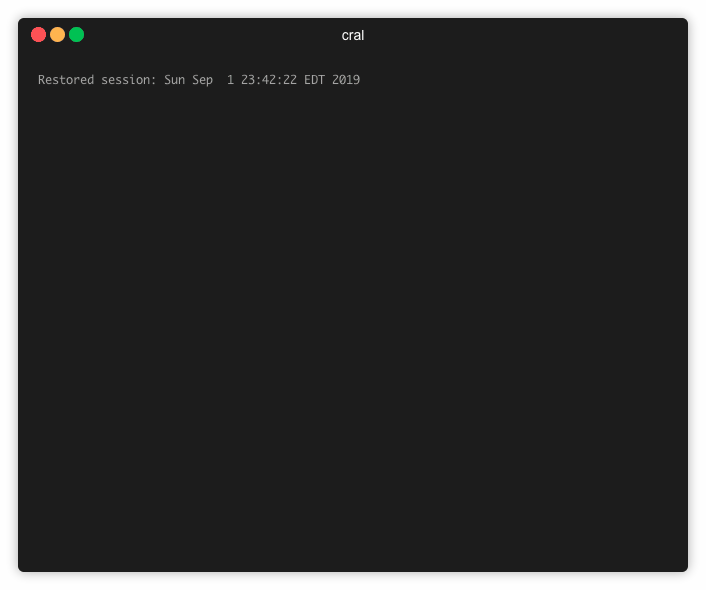
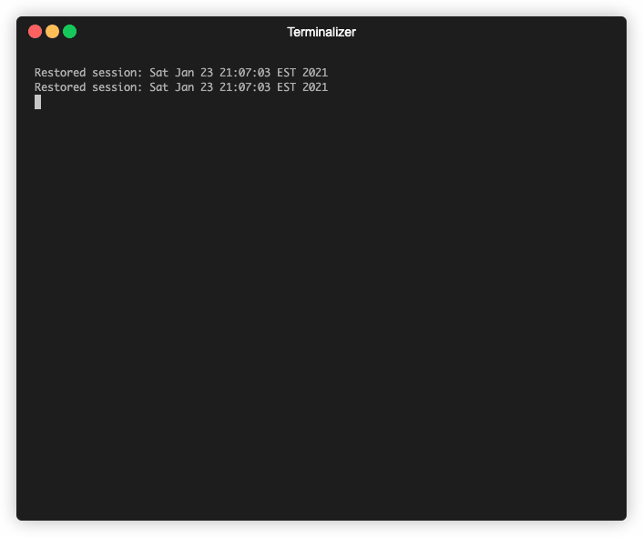

# cral-cli

> ⚠️ Rutgers changed the CAS login page January 10th 2021. Please upgrade to version 2 or higher for everything to function properly.

A command line interface that makes registering for courses at Rutgers University easy. Makes use of [Rutgers API](http://api.rutgers.edu/) and [Puppeteer](https://github.com/GoogleChrome/puppeteer) to poll for openings and register for classes respectively.


## Getting Started

These instructions will get you a copy of the project up and running on your local machine for development and testing purposes. See deployment for notes on how to deploy the project on a live system.

### Prerequisites

Make sure you have Node.js 8 or newer installed. You can do so directly [here](https://nodejs.org/en/download/) or use [homebrew](https://changelog.com/posts/install-node-js-with-homebrew-on-os-x) if you're on macOS.

### Installing

#### NPM

Install the package globally so you can run it anywhere.

```
$ npm i cral-cli -g
```

#### Github

Clone the repository to keep up with the latest changes.

```
$ git clone https://github.com/fireteam99/cral-cli.git
```

Change directory to the cloned repository and create a symlink so you can run the cli anywhere

```
$ cd cral-cli
$ npm link
```

## Running the tests

This project uses Jest for tests.

```
$ npm test
```

## Usage

### Set Configuration

**Description:** Set your configuration options. Running the command without any flags to set all settings. Alternatively, you can pass any number of optional flags to only configure specific settings (only those settings will show up in the prompt).

**Command:** `cral c` or `cral configure`

**Flags:**

-   `-u` or `--username` Configure username.
-   `-p` or `--password` Configure password.
-   `-y` or `--year` Configure year.
-   `-t` or `--term` Configure term.
-   `-c` or `--campus` Configure campus.
-   `-l` or `--level` Configure level.
-   `-n` or `--notification` Configure notification.
-   `-t` or `--timeout` Configure timeout.
-   `-r` or `--randomization` Configure randomization.
-   `-o` or `--cloud` Configure cloud.
-   `-iv` or `--verifyIndex` Configure index verification.
-   `-v` or `--verbose` More detailed error messages.

**Usage:**

-   `cral c` Configures all settings.
-   `cral c -u -p` Configure username and password.
-   `cral c -l -c -iv` Configure level, campus, and index verification.


### View Configuration

**Description:** View your configuration settings. By default your password is is hidden - to view it pass in `-p` as a flag.

> ℹ️ Invalid configuration options will show up as red.

**Command:** `cral d` or `cral display`

**Flags:**

-   `-p` or `--password` Display password.
-   `-v` or `--verbose` More detailed error messages.



### Fix Configuration

**Description:** Fix any errors that are present in your configuration settings.

**Command:** `cral f` or `cral fix`

**Flags:**

-   `-v` or `--verbose` More detailed error messages.



### Reset Configuration

**Description:** Reset your configuration settings. Will prompt you to confirm that you want to reset them.

**Command:** `cral rs` or `cral reset`

### Register for Course

**Description:** Register for a course by using `cral r` and following the prompts or directly passing in the index and time - `cral r <index #> -t <time to run in minutes>`. If the verify index option is turned on, cral will attempt to look up the index passed and display the section information along with a confomation prompt. Then, the program will check for a course opening on an interval defined by `timeout` and `randomization` (in configurations) and attempts to register if an opening is detected. Upon a successful registration or unexpected error, a screenshot will be taken and it's path outputted.

**Command:** `cral register [index]` or `cral r [index]`

**Flags:**

-   `-t <time>` Sets the amount of time you want the program to run. Note: this flag is ignored if you do not directly pass the index.
-   `-u <username>` Override username used for this registration attempt.
-   `-p <password>` Override password used for this registration attempt.
-   `-v` or `--verbose` Log more information to console and more detailed error messages.
-   `-d` or `--debug` Runs puppeteer in non-headless mode.

**Note:**

-   Not passing a time `-t <time>` to run when passing in the index directly results in no time limit.


### Help

Run `cral -h` or `cral --help` for instructions on how to use the cli.

## API

Some of the core functions that cral-cli depends on are availible to be called programmatically. Please note that this package has not been tested on the browser and probably won't work.

```js
// common.js
const cral = require('cral-cli');

// esm
import cral from 'cral-cali';
```

### `cral.getCASCookies(username, password, [puppeteerOptions])`

---

`getCASCookies` is an async function used to grab the cookies used for authenticating a user for [Webreg](https://sims.rutgers.edu/webreg/) using the [Central Authorization System](https://cas.rutgers.edu/login). [puppeteerOptions](https://pptr.dev/#?product=Puppeteer&version=v5.5.0&show=api-puppeteerlaunchoptions) defines an object that is passed as the launch options to puppeteer. Returns a promise that resolves into the [page cookies](https://pptr.dev/#?product=Puppeteer&version=v5.5.0&show=api-pagecookiesurls).

**Arguments:**

-   username: `string`
-   password: `string`
-   puppeteerOptions = {}: [`Object`](https://pptr.dev/#?product=Puppeteer&version=v5.5.0&show=api-puppeteerlaunchoptions) - launch options for Puppeteer

**Returns:** [`Promise<Object>`](<(https://pptr.dev/#?product=Puppeteer&version=v5.5.0&show=api-pagecookiesurls)>)

```js
// promises
cral.getCASCookies('user', 'pass')
    .then(cookies => console.log(cookies))
    .catch(err => console.error(err));

// async await
(async () => {
    try {
        const cookies = await cral.getCASCookies('user', 'pass', {
            headless: false,
        });
    } catch (err) {
        console.error(err);
    }
})();
```

### `registerForIndex({ username, password, index, term, year, [baseTimeout], [randomization], [retryLimit], [puppeteerOptions] })`

---

`registerForIndex` is an async function that uses Puppeteer to register for classes through [Webreg](https://sims.rutgers.edu/webreg). Returns a promise that resolves into a return status object.

**Arguments:**

-   username: `string`
-   password: `string`
-   index: `string` - five digit string representing a section number, ex: '12345'
-   term: `string` - one digit string representing month (indexed by 0) each term starts on: '0' for winter, '1' for spring, '7' for summer, '9' for fall
-   year: `int`
-   baseTimeout = 1: `int` - seconds to wait before trying again if attempt fails, defaults to 1
-   randomization = 0: `int` - a randomization amount added to the `baseTimeout`, defaults to 0
-   retryLimit = 3: `int` - number of times to retry if attempt fails before giving up, defaults to 3
-   puppeteerOptions = {}: [`Object`](https://pptr.dev/#?product=Puppeteer&version=v5.5.0&)
-   show=api-puppeteerlaunchoptions) - launch options for Puppeteer

**Returns:** A promise that resolves into a return status object that contains the following fields:

-   index: `string`
-   hasRegistered: `boolean` - whether or not registration was successful
-   message: `string` - any success/failure message received from Webreg during the attempt
-   screenshot: `string` - the file path the screenshot taken during attempt (might be broken)

> ⚠️ The screenshot functionality is possibly broken and pending deprecation.

```js
const config = {
    username: 'name',
    password: 'pass',
    index: '12345',
    term: '0',
    year: 2021,
};

// promises
cral.registerForIndex(config)
    .then(result => console.log(result))
    .catch(err => console.error(err));

// async await
(async () => {
    try {
        const result = await cral.registerForIndex(config);
    } catch (err) {
        console.error(err);
    }
})();
```

### `getSectionInfo({ index, year, term, campus, level })`

---

`getSectionInfo` is an async function that returns the course and section information given an index. Returns a promise that resolves into an object containing course and section information.

**Arguments:**

-   index: `string` - five digit string representing a section number, ex: '12345'
-   year: `int`
-   term: `string` - one digit string representing month (indexed by 0) each term starts on: '0' for winter, '1' for spring, '7' for summer, '9' for fall
-   campus: `string` - two character string where: "NB" is New Brunswick, "NK" is Newark, and "CM" is Camden
-   level: `string` - one character string where: "U" is undergraduate and "G" is graudate.

**Returns:** A promise that resolves into an object that contains the course and section information.

```js
const config = {
    index: '12345',
    year: 2021,
    term: '0',
    campus: 'NB',
    level: 'U',
};

// promises
cral.getSectionInfo(config)
    .then(info => console.log(info))
    .catch(err => console.error(err));

// async await
(async () => {
    try {
        const { section, course } = await cral.getSectionInfo(config);
        console.log(section);
        console.log(course);
    } catch (err) {
        console.error(err);
    }
})();
```

### `sectionOpen({ index, year, term, campus, level })`

---

`sectionOpen` is an async function returns whether not a section is open.

**Arguments:**

-   index: `string` - five digit string representing a section number, ex: '12345'
-   year: `int`
-   term: `string` - one digit string representing month (indexed by 0) each term starts on: '0' for winter, '1' for spring, '7' for summer, '9' for fall
-   campus: `string` - two character string where: "NB" is New Brunswick, "NK" is Newark, and "CM" is Camden
-   level: `string` - one character string where: "U" is undergraduate and "G" is graudate.

**Returns:** `Promise<boolean>`

```js
const config = {
    index: '12345',
    year: 2021,
    term: '0',
    campus: 'NB',
    level: 'U',
};

// promises
cral.sectionOpen(config)
    .then(isOpen => console.log(isOpen))
    .catch(err => console.error(err));

// async await
(async () => {
    try {
        const isOpen = await cral.sectionOpen(config);
    } catch (err) {
        console.error(err);
    }
})();
```

More detailed documentation coming soon!

## What's Next

-   Concurrent registration for multiple indexes
-   Ability to drop certain conflicting classes when registering
-   More comprehensive tests

## Deployment

If you're running this on a cloud environment such as Heroku, CodeAnywhere, or Cloud9, make sure to set the configuration setting `cloud` to true.

## Built With

-   [Puppeteer](https://pptr.dev) - A Node library to control Chrome/Chromium
-   [Commander.js](https://github.com/tj/commander.js/) - Library for command line interfaces
-   [Inquier.js](https://github.com/SBoudrias/Inquirer.js/) - Provided interactive command line prompts
-   [node-notifier](https://www.npmjs.com/package/node-notifier) - Live notifications for Node.js

## Contributing

Pull requests are welcome. For major changes, please open an issue first to discuss what you would like to change.

## Versioning

We use [SemVer](http://semver.org/) for versioning. For the versions available, see the [tags on this repository](https://github.com/fireteam99/cral-cli/tags).

## Authors

-   **Ray Sy** - _Initial work_ - [fireteam99](https://github.com/fireteam99)

See also the list of [contributors](https://github.com/fireteam99/cral-cli/graphs/contributors) who participated in this project.

## License

This project is licensed under the MIT License - see the [LICENSE.md](LICENSE.md) file for details.

## Acknowledgments

-   Shout-out to [Terminalize](https://github.com/faressoft/terminalizer) for the sweet command line screenshots.
