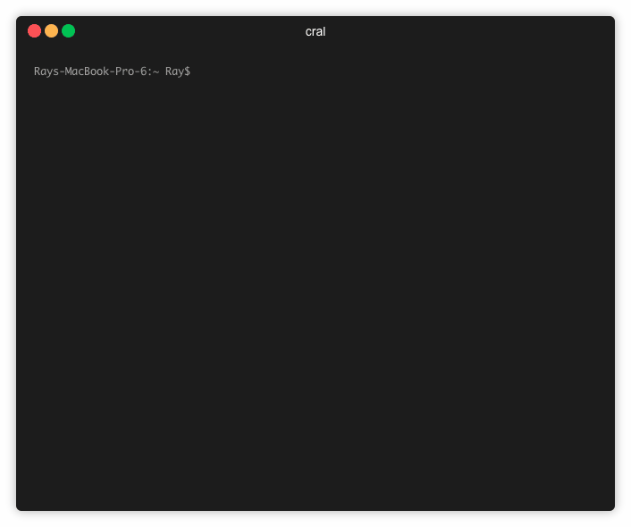

# cral-cli

A command line interface that makes registering for courses at Rutgers University easier. Makes use of [Rutgers API](http://api.rutgers.edu/) and [Puppeteer](https://github.com/GoogleChrome/puppeteer) to poll for openings and register for classes respectively.


## Getting Started

These instructions will get you a copy of the project up and running on your local machine for development and testing purposes. See deployment for notes on how to deploy the project on a live system.

### Prerequisites

Make sure you have Node.js 8 or newer installed. You can do so directly [here](https://nodejs.org/en/download/) or use [homebrew](https://changelog.com/posts/install-node-js-with-homebrew-on-os-x) if you're on macOS.

### Installing

#### NPM

Install the package globally so you can run it anywhere.

```
$ npm i cral-cli -g
```

#### Github

Clone the repository to keep up with the latest changes.

```
$ git clone https://github.com/fireteam99/cral-cli.git
```

Change directory to the cloned repository and create a symlink so you can run the cli anywhere

```
$ cd cral-cli
$ npm link
```

## Running the tests

This project uses Jest for tests.

```
$ npm test
```

## Usage

### Set Configuration

**Description:** Set your configuration options. Running the command without any flags to set all settings. Alternatively, you can pass any number of optional flags to only configure specific settings.

**Command:** `cral c` or `cral configure`

**Flags:**

-   `-u` or `--username` Configure username
-   `-p` or `--password` Configure password
-   `-y` or `--year` Configure year
-   `-t` or `--term` Configure term
-   `-c` or `--campus` Configure campus
-   `-l` or `--level` Configure level
-   `-n` or `--notification` Configure notification
-   `-t` or `--timeout` Configure timeout
-   `-r` or `--randomization` Configure randomization
-   `-o` or `--cloud` Configure cloud
-   `-v` or `--verifyIndex` Configure index verification



### View Configuration

**Description:** View your configuration settings. By default your password is is hidden - to view it pass in `-p` as a flag.

**Command:** `cral d` or `cral configure`

**Flags:**

-   `-p` or `--password` Display password


### Reset Configuration

**Description:** Reset your configuration settings. Will prompt you to confirm that you want to reset them.

**Command:** `cral rs` or `cral reset`
ode.js c

### Register for Course

**Description:** Register for a course by using `cral r` and following the prompts or directly passing in the index and time - `cral r <index #> -t <time to run in minutes>`. If the verify index option is turned on, cral will attempt to look up the index passed and display the section information along with a confomation prompt. Then, the program will check for a course opening on an interval defined by `timeout` and `randomization` (in configurations) and attempts to register if an opening is detected. Upon a successful registration or unexpected error, a screenshot will be taken and it's path outputted.

**Command:** `cral register [index]` or `cral r [index]`

**Flags:**

-   `-t <time>` Sets the amount of time you want the program to run. Note: this flag is ignored if you do not directly pass the index.
-   `-v` or `--verbose` Log more information to console.
-   `-d` or `--debug` Runs puppeteer in non-headless mode.
-   `-u <username>` Override username used for this registration attempt.
-   `-p <password>` Override password used for this registration attempt.

**Note:**

-   Not passing a time `-t <time>` to run when passing in the index directly results in no time limit.


### Help

Run `cral -h` or `cral --help` for instructions on how to use the cli.

## What's Next

-   Registration for multiple indexes
-   Verify log-in information
-   Re-do configuration system
-   Ability to drop certain conflicting classes when registering
-   More comprehensive tests

## Deployment

If you're running this on a cloud environment such as Heroku, CodeAnywhere, or Cloud9, make sure to set the configuration setting `cloud` to true.

## Built With

-   [Puppeteer](https://pptr.dev) - A Node library to control Chrome/Chromium
-   [Commander.js](https://github.com/tj/commander.js/) - Library for command line interfaces
-   [Inquier.js](https://github.com/SBoudrias/Inquirer.js/) - Provided interactive command line prompts
-   [node-notifier](https://www.npmjs.com/package/node-notifier) - Live notifications for Node.js

## Contributing

This is an open source project so feel free to fork and/or contribute at anytime. This project uses the fork and pull request workflow.

## Versioning

We use [SemVer](http://semver.org/) for versioning. For the versions available, see the [tags on this repository](https://github.com/fireteam99/cral-cli/tags).

## Authors

-   **Ray Sy** - _Initial work_ - [fireteam99](https://github.com/fireteam99)

See also the list of [contributors](https://github.com/fireteam99/cral-cli/graphs/contributors) who participated in this project.

## License

This project is licensed under the MIT License - see the [LICENSE.md](LICENSE.md) file for details

## Acknowledgments

-   Shout-out to [Terminalize](https://github.com/faressoft/terminalizer) for the dope command line screenshots
